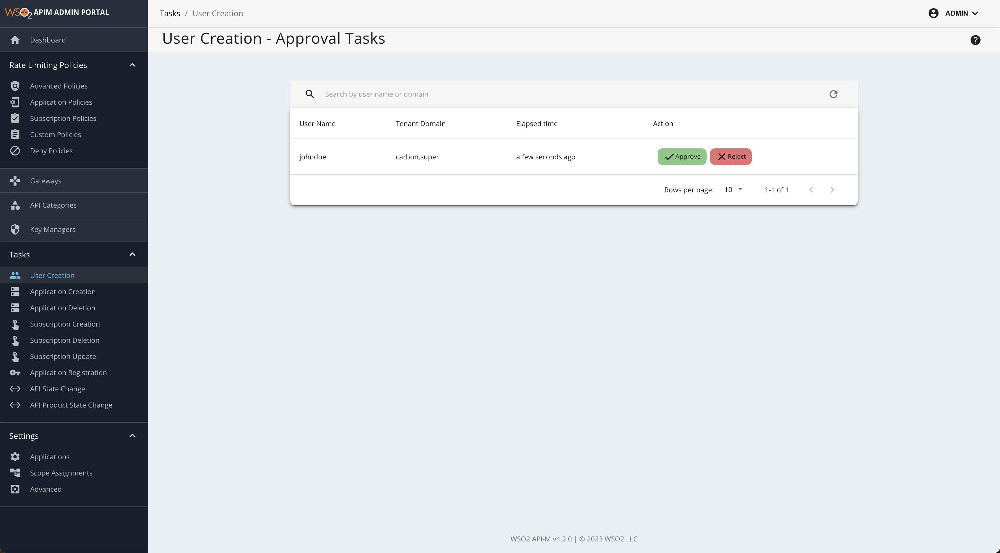
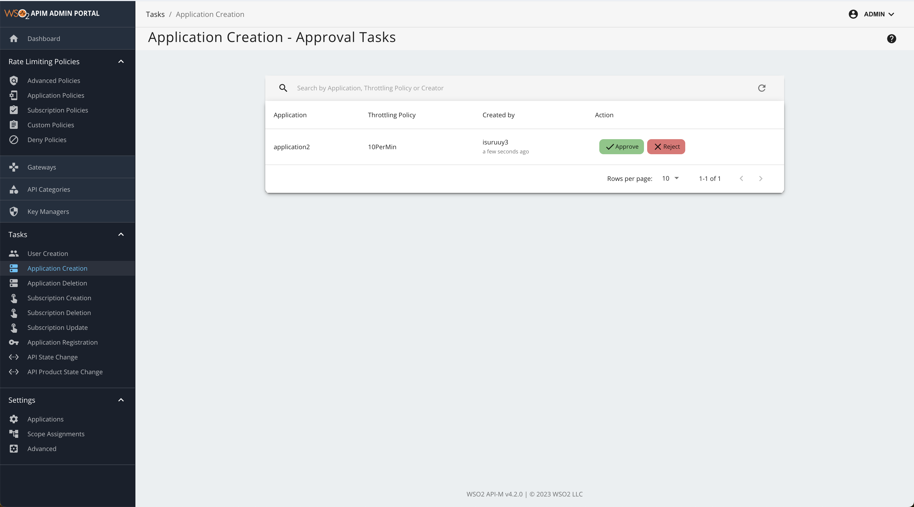

# Adding User and Application Creation Workflow
Attaching a custom workflow to the user and application creation processes allows admin users to manage these actions more effectively by providing an option to approve or reject each creation request. This ensures that user and application creation is fully controlled and monitored by administrators.

Healthcare accelerator provides the following capabilities. 

- View the user details in a user creation request. 
- Option to approve/reject user creation request. 
- View the application details in a application creation request. 
- Option to approve/reject application creation request. 

## How to enable the User/Application creation workflow 
1. Follow the [Installation Steps](../../install-and-setup/manual.md) to install the Healthcare Accelerator. 
2. After extracting WSO2 OH APIM Accelerator to `<WSO2_APIM_HOME>`, navigate to `<WSO2_OH_APIM_ACC_HOME>`/conf/config.toml file, and enable the following configuration. 
```
enable_developer_workflow = true
```
3. Navigate to `<WSO2_OH_APIM_ACC_HOME>`/bin and run the merge script. 
```
merge.sh
```
4. Start the API Manager server by navigating to `<WSO2_APIM_HOME>`/bin and executing `./api-manager.sh`
5. Sign in to WSO2 APIM Management Console (https://`<Server-Host>`:9443/carbon) through the web browser as the admin. 
6. Navigate to  Resources -> Browse and go to /_system/governance/apimgt/applicationdata/workflow-extensions.xml in the edit mode. (Edit as text)
7. Enable Approval Workflow Executor for user and application creation. 
```
<UserSignUp executor="org.wso2.healthcare.apim.workflow.extensions.OpenHealthcareUserSignUpApprovalWorkflowExecutor"/>
<ApplicationCreation executor="org.wso2.healthcare.apim.workflow.extensions.OpenHealthcareApplicationCreationApprovalWorkflowExecutor"/>
```
8. Once the changes are done, click on Save Content .The application and user creation Approve Workflow Executors are now engaged.

## Testing the user creation flow
1. Navigate to Dev portal (https://localhost:9443/devportal) and self signup a user. 


2. Once the user creation is successful, this request will be displayed in the Admin Portal for admins to approve. Without the approval of the Admin, users are not permitted to login. 

3. Sign in to the Admin Portal (https://localhost:9443/admin) and click on '**User Creation**'. 

3. The user creation request is displayed in the Admin Portal for admins to approve. 


4. Once admin approves the request, the user should be able to login to the Devportal. 

## Testing the application creation flow
1. Sign in to the Devportal and create an application. 
2. Since the application creation flow is enabled, initially application will remain as inactive until it gets approved. 
3. Login to the Admin Portal (https://localhost:9443/admin) and click on '**Application Creation**'. 
4. The application creation request is displyed in the Admin Portal for Admin user to approve/reject. 

5. Once the application creation request is approved, user should be able to use the application as it becomes active. 