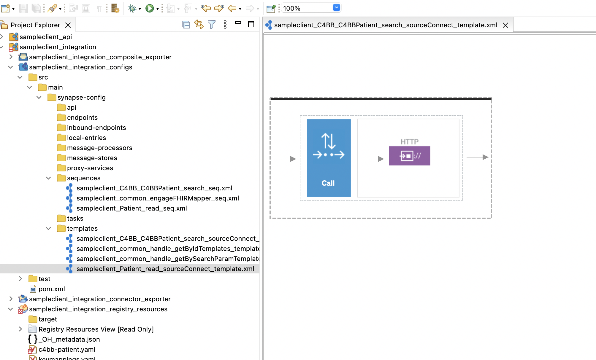

# Example

## Coverting XML payload to C4BB Patient Example

This example will guide you to convert an XML Payload to [CRBB-Patient profile.](http://hl7.org/fhir/us/carin-bb/STU1.1/StructureDefinition-C4BB-Patient.html)

## What you will build
1. Data Service to create the XML Payload. 
```
<patientCollection xmlns="http://ws.wso2.org/dataservice">
    <patient>
        <id>285137</id>
        <ethnicity__pc>Unknown</ethnicity__pc>
        <suffix xmlns:xsi="http://www.w3.org/2001/XMLSchema-instance" xsi:nil="true"/>
        <gender__pc>Female</gender__pc>
        <lastname>OVERKAMP</lastname>
        <personbirthdate>1987-11-03+05:30</personbirthdate>
        <firstname>JUSTIN</firstname>
        <middlename xmlns:xsi="http://www.w3.org/2001/XMLSchema-instance" xsi:nil="true"/>
        <phone>(062) 8377233</phone>
        <marital_status__pc xmlns:xsi="http://www.w3.org/2001/XMLSchema-instance" xsi:nil="true"/>
        <language_other xmlns:xsi="http://www.w3.org/2001/XMLSchema-instance" xsi:nil="true"/>
        <language__c>English</language__c>
        <billingcountrycode>US</billingcountrycode>
        <personmailingpostalcode>344532</personmailingpostalcode>
        <personmailingstate>NY</personmailingstate>
        <personmailingcity>New York</personmailingcity>
        <personmailingstreet>1150 476 Co Rd</personmailingstreet>
        <date_of_death__pc xmlns:xsi="http://www.w3.org/2001/XMLSchema-instance" xsi:nil="true"/>
        <primary_insurance_number__pc xmlns:xsi="http://www.w3.org/2001/XMLSchema-instance" xsi:nil="true"/>
        <ethnicity_race_other__pc xmlns:xsi="http://www.w3.org/2001/XMLSchema-instance" xsi:nil="true"/>
        <lastmodifieddate>2020-01-23+05:30</lastmodifieddate>
    </patient>
</patientCollection>
```
2. FHIR Mappings to map the elements of the existing payload to the CRBB-Patient profile. 
3. CRBB Patient Payload. 
```
{
    "resourceType": "Bundle",
    "meta": {
        "lastUpdated": "2022-05-24T23:42:32.221+00:00"
    },
    "type": "searchset",
    "total": 1,
    "entry": [
        {
            "resource": {
                "resourceType": "Patient",
                "id": "285137",
                "meta": {
                    "profile": [
                        "http://hl7.org/fhir/us/carin-bb/StructureDefinition/C4BB-Patient"
                    ]
                },
                "extension": [
                    {
                        "url": "http://hl7.org/fhir/us/core/StructureDefinition/us-core-ethnicity",
                        "extension": [
                            {
                                "url": "text",
                                "valueString": "Unknown"
                            }
                        ]
                    },
                    {
                        "url": "http://hl7.org/fhir/us/core/StructureDefinition/us-core-birthsex",
                        "valueString": "F"
                    }
                ],
                "identifier": [
                    {
                        "type": {
                            "coding": [
                                {
                                    "system": "http://terminology.hl7.org/CodeSystem/v2-0203",
                                    "code": "MB",
                                    "display": "Member Number"
                                }
                            ]
                        },
                        "value": "285137"
                    }
                ],
                "name": [
                    {
                        "family": "OVERKAMP",
                        "given": [
                            "JUSTIN"
                        ]
                    }
                ],
                "telecom": [
                    {
                        "system": "phone",
                        "value": "(062) 8377233"
                    }
                ],
                "gender": "female",
                "birthDate": "1987-11-03",
                "address": [
                    {
                        "type": "physical",
                        "line": [
                            "1150 476 Co Rd"
                        ],
                        "city": "New York",
                        "state": "NY",
                        "postalCode": "344532",
                        "country": "US"
                    }
                ],
                "communication": [
                    {
                        "language": {
                            "coding": [
                                {
                                    "system": "urn:ietf:bcp:47",
                                    "code": "en"
                                }
                            ]
                        }
                    }
                ]
            }
        }
    ]
}
```
## Setting up the environment

### Setting up mySQL Database 
1. Install the MySQL server.
2. Create the following database: Patients
```
CREATE DATABASE Patients;
```
3. Create the following table:
```
use Patients;

CREATE TABLE `patient` (
  `id` int(11) NOT NULL,
  `ethnicity__pc` varchar(45) DEFAULT NULL,
  `suffix` varchar(45) DEFAULT NULL,
  `gender__pc` varchar(45) DEFAULT NULL,
  `lastname` varchar(45) DEFAULT NULL,
  `personbirthdate` date DEFAULT NULL,
  `firstname` varchar(45) DEFAULT NULL,
  `middlename` varchar(45) DEFAULT NULL,
  `phone` varchar(45) DEFAULT NULL,
  `marital_status__pc` varchar(45) DEFAULT NULL,
  `language_other` varchar(45) DEFAULT NULL,
  `language__c` varchar(45) DEFAULT NULL,
  `billingcountrycode` varchar(45) DEFAULT NULL,
  `personmailingpostalcode` varchar(45) DEFAULT NULL,
  `personmailingstate` varchar(45) DEFAULT NULL,
  `personmailingcity` varchar(45) DEFAULT NULL,
  `personmailingstreet` varchar(45) DEFAULT NULL,
  `date_of_death__pc` date DEFAULT NULL,
  `primary_insurance_number__pc` varchar(45) DEFAULT NULL,
  `ethnicity_race_other__pc` varchar(45) DEFAULT NULL,
  `lastmodifieddate` date DEFAULT NULL,
  PRIMARY KEY (`id`)
) ENGINE=InnoDB DEFAULT CHARSET=latin1;
```

4. Enter the following data into the table:
```
insert into patient (id,ethnicity__pc,gender__pc,lastname,personbirthdate,firstname,phone,language__c,billingcountrycode,personmailingpostalcode,personmailingstate,personmailingcity,personmailingstreet,lastmodifieddate) values(285137,'Unknown','Female','OVERKAMP','1987-11-03','JUSTIN','(062) 8377233', 'English','US','344532','NY','New York','1150 476 Co Rd','2020-01-23');
```

### Creating the Data Service
The Data Service is created to use as the backend source. You can use any backend or EHR System. 

1. Create a Data Service using [WSO2 Enterprise Integrator](https://wso2.com/enterprise-integrator/6.6.0). Please refer 
[Generating a Data Service](https://docs.wso2.com/display/EI660/Generating+a+Data+Service)

2. You can use the following DataService xml file for the reference when creating the queries. 
[DataService.xml](../../assets/attachments/learn/fhir-mapping-templates/dataservice.xml)

3. Invoke the Dataservice with the following URL, and you should be able to see a response in the step 1. Now the backend
source is ready to be used. 
``` 
curl --location --request GET 'http://localhost:8280/services/patient_DataService.SOAP12Endpoint/patient/285137'
```


### Import Projects
The user will be provided two project zip files, which are projectsGenerationTool_sampleclient_api.zip file and projectsGenerationTool_sampleclient_integration.zip file. These need to be imported to [WSO2 Integration Studio](https://wso2.com/integration/integration-studio/)

1. Unzip the two projects. 
2. Please follow the steps to import the projects to the Integration Studio. [Import-Projects](https://apim.docs.wso2.com/en/latest/integrate/develop/importing-projects/)


### Step 1: Implementing business logic
1. No mandatory changes will be done to The sampleclient_api project. 
2. Open the source integration project, and the following changes need to be done. Before connect to the backend source
and fetch data, the business logic needs to be implemented in <organization_name>_<IG_name>_<FHIR_resource_name>_<Interaction_name>_seq.xml in the source integration project. 

In this example, it is **sampleclient_C4BB_C4BBPatient_search_seq.xml** 

Developers can implement any business logic using the standard WSO2 integration components(mediators, connectors etc.) by dragging and dropping to the canvas from the integration studio tool palette just before the source connect logic is triggered from the call template mediator. 


### Step 2:Implement source system connection logic for the relevant FHIR API

This can be found under the templates section of the synapse-configs of the source integration project which ends with 
sourceConnect_template suffix. 

In this example, it is **sampleclient_C4BB_C4BBPatient_search_sourceConnect_template.xml**

In this step we can provide the Data Service endpoint using a call mediator. 


The source will be as below. 
```
<?xml version="1.0" encoding="UTF-8"?>
<template name="sampleclient_C4BB_C4BBPatient_search_sourceConnect_template" xmlns="http://ws.apache.org/ns/synapse">
    <parameter defaultValue="" isMandatory="false" name="id"/>
    <sequence>
        <call>
            <endpoint>
                <http method="get" uri-template="http://localhost:8280/services/patient_DataService.SOAP12Endpoint/patient/285137">
                    <suspendOnFailure>
                        <initialDuration>-1</initialDuration>
                        <progressionFactor>-1</progressionFactor>
                        <maximumDuration>0</maximumDuration>
                    </suspendOnFailure>
                    <markForSuspension>
                        <retriesBeforeSuspension>0</retriesBeforeSuspension>
                    </markForSuspension>
                </http>
            </endpoint>
        </call>
    </sequence>
</template>
```

### Step 3: Implement the FHIR Mappings

After having the source payload from backend sources, then you can implement the FHIR mappings. Go to the Source 
integration project and open the **registry resources** project. There are three types of templates which are in yaml format.
- Resource Mapping templates
- Key Value Mapping template file (keymappings.yaml)
- Conditions mapping template file (conditions.yaml)

**Resource templates**
Developer only needs to fill the relevant source value from the source payload using relevant Xpath or a JsonPath. In this 
example **c4bb-patient.yaml** file. 

We need to provide the following Xpaths according to the example. 
1. Path to source payload root element
    - **read: //patientCollection/patient**
2. Relative path to source payload child data elements
    - **source -> read: -> //id**


**Key Value template**
The Key Value Mapping template file is used to resolve the source system values with the FHIR specific values for 
resource fields. For example in the FHIR Patient resource, the gender field should only have standard values defined 
by the FHIR specification which are ‘male’ for Male, ‘female’ for Female. In source systems, these kinds of data may 
have a different representation. In such cases we can use the Key Value Mapping template to map the source system 
representation to the standard FHIR representation. 

### Step 4: Export Composite application and deploy in the Micro Integrator. 
After completing the above steps, you can export the deployable composite applications for the two projects. 
Following artifacts need to be deployed in the WSO2 openhealthcare integration server in order to make FHIR mapper templates to work.

- FHIR Integration API carbon app -> repository/deployment/server/carbonapps
- FHIR Source Integration carbon ap -> repository/deployment/server/carbonapps

[Exporting Integration Logic as a CApp](https://apim.docs.wso2.com/en/latest/integrate/develop/exporting-artifacts/)

## Testing
Apply wso2oh-mi-accelerator-3.0.0 in wso2 micro integrator. (A doc should be written in base-scenarios)

We can use Curl or Postman to try the API. The testing steps are provided for curl. Steps for Postman should be 
straightforward and can be derived from the curl requests.

Invoke the endpoint and you will be able to see the response in the step3. 
