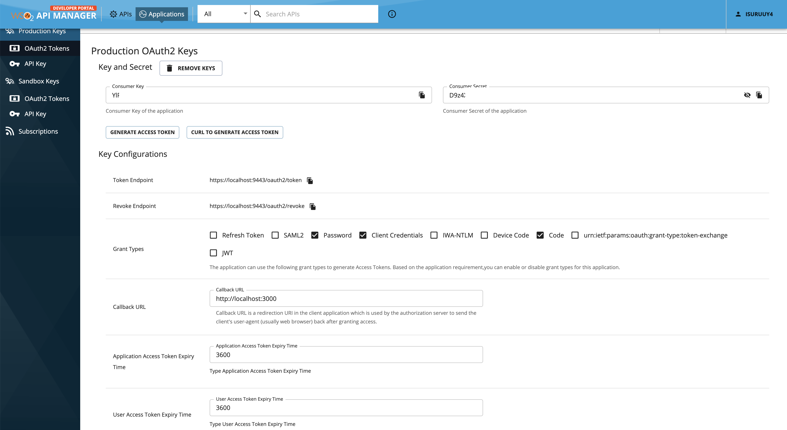
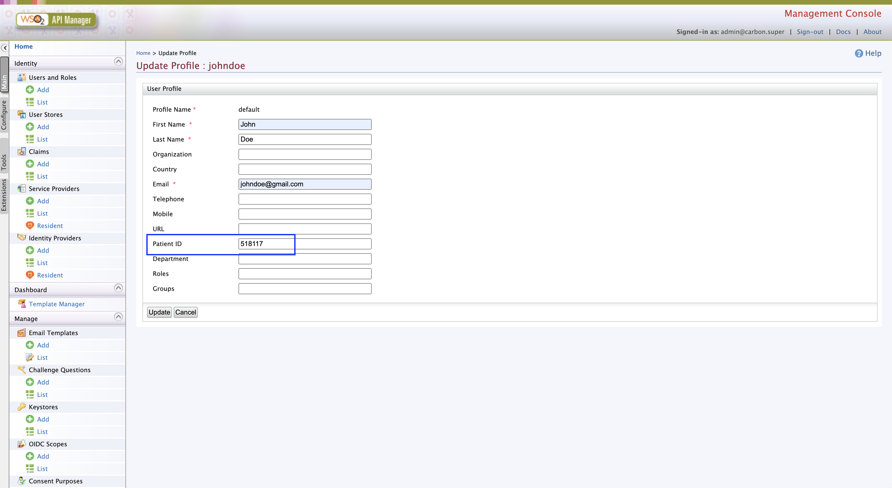
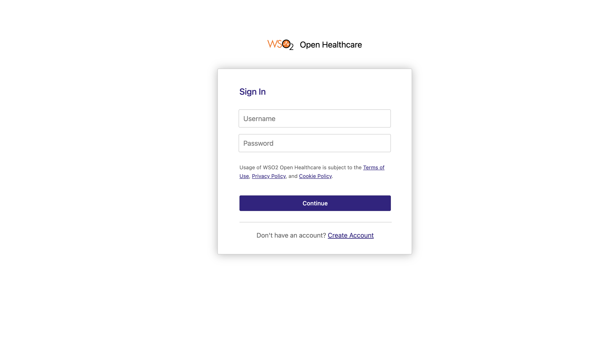

# Configuring SMART App Launch for a Patient User

In this example, we will walk through the steps to configure a SMART App Launch flow for a patient user, demonstrating how to retrieve the Patient ID using the SMART on FHIR flow using the Healthcare Accelerator.

## Prerequisites
1. Intall the latest WSO2 API Manager version and install the [WSO2 Healthcare Accelerator](../../install-and-setup/manual.md).
2. Start the WSO2 API Manager server by navigating to <APIM_HOME>/bin directory and executing this command. 
```
./api-manager.sh
```

## Step 1 - Create the Application 
1. Navigate to Developer Portal in your web browser: `https://localhost:9443/devportal/`
2. Self signup a user by clicking 'SIGN-IN' button, it will redirect you to the Authentication Portal. 
3. Click on 'Create Account' link, provide a username and click on 'Proceed to Self Register'. 
4. Fill in the details and create the account. 
5. Log into Devportal with the crendetials of the above user and follow steps 2-4 to [create a new application](https://apim.docs.wso2.com/en/4.2.0/design/api-security/oauth2/grant-types/authorization-code-grant/#try-authorization-code-grant), add `http://localhost:3000` as the redirect URL, and note down the Consumer key and Consumer Secret. 


## Step 2 - Assign Patient ID to a user
1. Self-Sign up another user(username: johndoe) and let's assign the Patient ID to that user. 
2. After Self Sign up, log into Carbon Colsole. `https://localhost:9443/carbon`
3. Go to Claim section and select 'List', and select `http://wso2.org/claims` and selct 'Patient ID' from the list. 
4. Edit the claim, and enable 'Supported by Default', and update.  
5. Go to 'Users and Roles', and get the particular user created, click on that user's 'User Profile', click on 'default', and update the Patient ID as '518117'. 

6. Sign out from the Carbon Console. 

## Step 3 - Get the endpoints
1. Invoke the well-known configuration to get the details about auth endpoint and token endpoint. 
`https://localhost:8243/r4/.well-known/smart-configuration`

2. You will get a JSON response as below. 
```
{
    "response_types_supported": [
        "code",
        "id_token",
        "token",
        "device",
        "id_token token"
    ],
    "capabilities": [
        "launch-standalone",
        "client-public",
        "client-confidential-symmetric",
        "context-standalone-patient",
        "sso-openid-connect",
        "permission-patient",
        "permission-offline"
    ],
    "code_challenge_methods_supported": "S256",
    "grant_types_supported": [
        "authorization_code",
        "client_credentials"
    ],
    "jwks_uri": "https://localhost:9443/oauth2/jwks",
    "revocation_endpoint": "https://localhost:9443/oauth2/revoke",
    "token_endpoint_auth_methods_supported": [
        "client_secret_basic",
        "client_secret_post"
    ],
    "scopes_supported": [
        "openid",
        "launch/patient",
        "patient/*.cruds",
        "user/*.cruds"
    ],
    "issuer": "https://localhost:9443/oauth2/token",
    "authorization_endpoint": "https://localhost:9443/oauth2/authorize",
    "token_endpoint": "https://localhost:9443/oauth2/token"
}
```

## Step 4 - Execute Authorization Code grant flow and retrive the Patient ID. 
1. Execute the following request in the URL. 
```
https://localhost:9443/oauth2/authorize?response_type=code&client_id=[CLIENT_ID]&scope=launch/patient openid fhirUser&redirect_uri=[REDIRECT_URL]
```
Replace the REDIRECT_URL and CLIENT_ID with the following values. 
    - REDIRECT_URL: http://localhost:3000
    - CLIENT_ID: Consumer Key that you copied in the Step 1. 

2. Once redirected to the Authntication Portal sign in with the user you created at step 2 (username: johndoe). 

3. Copy the 'code' value from the URL once user is redirected to the `http://localhost:3000`
4. Execute the following curl command. 
```
curl --location --request POST 'https://localhost:9443/oauth2/token?grant_type=authorization_code&code=[CODE_VALUE]&redirect_uri=[REDIRECT_URL]' \
--header 'Content-Type: application/x-www-form-urlencoded' \
--header 'Authorization: Basic <base64>(CONSUMER_KEY:CONSUMER_SECRET)'
```
5. You will get the access_token along with the id_token. 
6. By decoding the id_token you will be able to retrive the Patient Id that we assigned to user 'johndoe'. 
