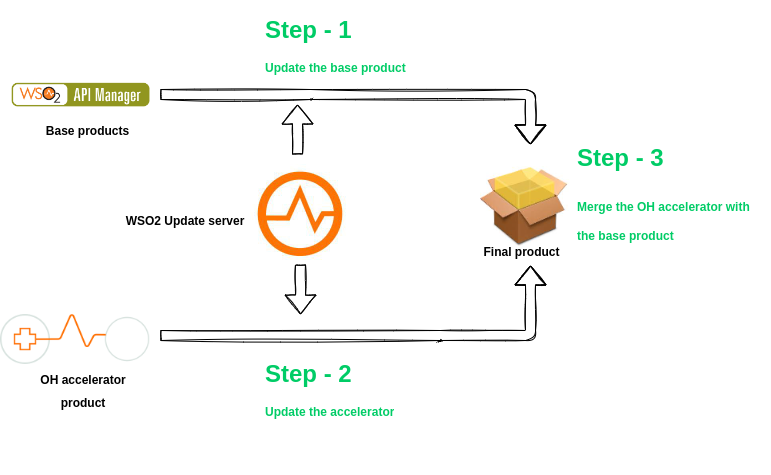

# How to update OH accelerator?

Usually OH accelerators are the implementation which accelerate and facilitate the FHIR related features, these accelerators will be applied on top of 
the wso2 base products like APIM and MI inorder to cater the healthcare domain problems.

Inorder to get updates for OH accelerators we need to get the update for two separate products as below,
- Download the GA/ Vanila pack of the wso2 base products like APIM or MI.
- Update the base products to the latest/ desire update level.
- Download the GA/ Vanila pack of the wso2 OH accelerator.
- Update the wso2 OH accelerator to the latest/ desire update level.
- Then apply the accelerator on top of the base product. Please read more about [installation of accelerator](/install-and-setup/manual).

# Continuous update

Receiving continuous updates to your environment can be done with ease using WSO2 recommended configuration management tools, which are Puppet and Ansible.
We highly recommend that to set up an automation tool like Puppet or Ansible, and automate the update process which mention [above](/install-and-setup/updates/update-accelerators).

Using this automation you can easily install and test new updates on lower environments, and can propagate to the higher environments like Production.

