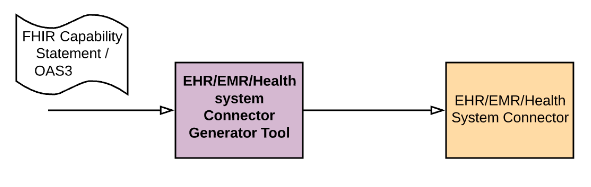
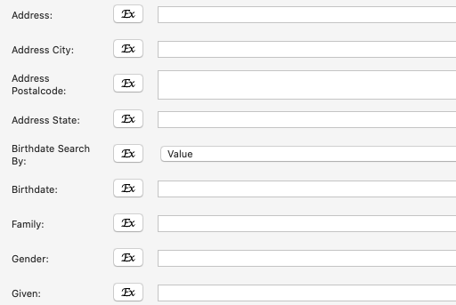
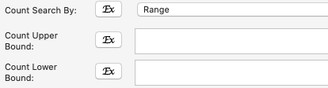
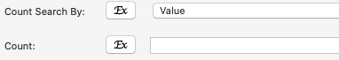

# EHR/EMR Connector Support

WSO2’s solution offers out of the box connectors for EPIC, Cerner, Athena Health EMRs and is capable of generating connectors automatically to any FHIR based or Open API specification based EHR/EMR system. These connectors will increase the developer productivity but are not a must for WSO2 to integrate with an EHR/EMR. 

Any EHR/EMR system that’s compliant with the FHIR specifications will expose a FHIR Capability Statement which provides information like the supported FHIR resources and operations of the EMR, FHIR version, authorization endpoints, etc.. The WSO2 Open Healthcare’s connector generator tool accepts this capability statement and generates the connector for the corresponding EMR.

The generated connectors support the following interactions.
* Create
* Update
* Delete
* Read
* Search

## Search Interaction

There will be seperate search operations for each of the FHIR resources supported by the EHR/EMR system. The search parameters supported by each resources will also be populated automatically.

According to the [FHIR specification](https://www.hl7.org/fhir/search.html#prefix) it is possible to do a search based on ranges for the parameters of types date, quantity and number. The connectors will be generated in such a way that it will be possible to select either search by range or value.

It is also possible to configure if the generated connector should not have an option to select from either range or value at all and use only the value.

There will be a field to pass any additional parameters to the search operations. This is useful if there is a need to pass any modifiers (:exact, :contains, etc) or prefixes. 

## Authentication

When generating a connector, it is possible to configure what kind of authentication mechanism the target EHR/EMR system supports. Currently, the support is available for Oathu2, [SMART backend authentication](http://www.hl7.org/fhir/smart-app-launch/backend-services.html) and basic authentication.
